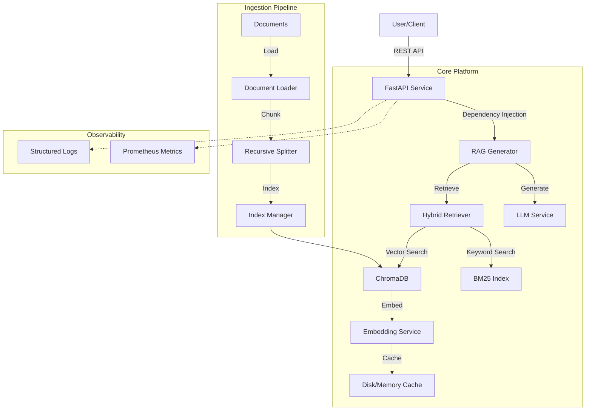

# Enterprise RAG Platform 🚀

A production-ready, modular **Retrieval-Augmented Generation (RAG)** platform built with Python, FastAPI, and ChromaDB. Designed for enterprise scale, observability, and extensibility.


## 🌟 Key Features

*   **🏭 Production-Grade Architecture**: Modular design with dependency injection, type-safe config, and centralized error handling.
*   **📄 Universal Ingestion**: robust loaders for PDF, DOCX, and TXT with recursive semantic chunking.
*   **🧠 Hybrid Retrieval**: Combines **Vector Search** (Semantic) + **BM25** (Keyword) using **Reciprocal Rank Fusion (RRF)** for superior accuracy.
*   **🔌 Pluggable Embeddings**: Support for **OpenAI**, **Groq**, and **Local (HuggingFace)** models with two-tier caching (Memory + Disk).
*   **🤖 LLM Agnostic**: Seamless integration with OpenAI and Groq (Llama 3, Mixtral) via a unified interface.
*   **📊 RAG Evaluation**: Built-in pipeline using **Ragas** to measure Faithfulness, Answer Relevancy, and Context Precision.
*   **👁️ Observability**: Structured JSON logging, Correlation IDs, and Prometheus Metrics out-of-the-box.
*   **🚀 API First**: High-performance FastAPI service with Pydantic validation and auto-generated docs.

---

## 🏗️ Architecture



---

## 🚀 Quick Start

### Prerequisites

*   Python 3.10+
*   Docker (optional)
*   API Keys (OpenAI or Groq)

### 1. Installation

```bash
# Clone the repository
git clone https://github.com/your-org/enterprise-rag-platform.git
cd enterprise-rag-platform

# Create virtual environment
python -m venv venv
source venv/bin/activate  # Windows: venv\Scripts\activate

# Install dependencies
pip install -r requirements.txt
```

### 2. Configuration

Copy the example environment file and set your keys:

```bash
cp .env.example .env
```

Edit `.env`:
```ini
OPENAI_API_KEY=sk-...
# OR
GROQ_API_KEY=gsk-...

ENV=dev  # dev or prod
```

### 3. Ingest Documents

Place your documents (PDF, TXT, DOCX) in the `data/` directory.

```bash
# Run the ingestion script (you can create this based on usage examples)
python examples/ingest_data.py
```

### 4. Run the API

```bash
uvicorn src.api.app:app --reload
```

Visit `http://localhost:8000/docs` for the interactive API documentation.

---

## 🐳 Docker Deployment

Build and run with Docker Compose:

```bash
docker-compose up --build -d
```

*   **API**: `http://localhost:8000`
*   **Health Check**: `http://localhost:8000/health`
*   **Metrics**: `http://localhost:8000/metrics`

---

## 💡 Usage Examples

### Python SDK

```python
from src.core.config import get_config
from src.generation import RAGGenerator, OpenAILLM
from src.retrieval import HybridRetriever
from src.embeddings import EmbeddingFactory
from src.vector_store import ChromaVectorStore

# 1. Initialize Components
config = get_config()
embedder = EmbeddingFactory.create(config)
vector_store = ChromaVectorStore(config)
retriever = HybridRetriever(vector_store, embedder)
llm = OpenAILLM(model_name="gpt-3.5-turbo")

# 2. Create Generator
rag = RAGGenerator(llm, retriever)

# 3. Ask a Question
response = rag.generate("What is the vacation policy?")

print(f"Answer: {response['answer']}")
print(f"Sources: {[doc['metadata']['source'] for doc in response['source_documents']]}")
```

### API Request

```bash
curl -X POST "http://localhost:8000/rag" \
     -H "Content-Type: application/json" \
     -d '{
           "query": "Explain the project architecture",
           "top_k": 3
         }'
```

---

## 🧪 Testing & Evaluation

Run unit tests:
```bash
pytest tests/
```

Run RAG evaluation (requires Ragas):
```bash
# See examples/evaluate_rag.py
python examples/evaluate_rag.py
```

---

## 📁 Project Structure

```
.
├── config/                 # Configuration files (base, dev, prod)
├── data/                   # Raw documents for ingestion
├── src/
│   ├── api/                # FastAPI application & routes
│   ├── core/               # Core utilities (config, logging, errors)
│   ├── embeddings/         # Embedding providers & caching
│   ├── evaluation/         # Ragas evaluation pipeline
│   ├── generation/         # LLM & RAG logic
│   ├── ingestion/          # Document loaders & chunking
│   ├── retrieval/          # Hybrid search implementation
│   └── vector_store/       # ChromaDB interface
├── tests/                  # Unit & integration tests
├── Dockerfile              # Docker build definition
└── requirements.txt        # Python dependencies
```

## 🤝 Contributing

1. Fork the repository
2. Create your feature branch (`git checkout -b feature/amazing-feature`)
3. Commit your changes (`git commit -m 'Add amazing feature'`)
4. Push to the branch (`git push origin feature/amazing-feature`)
5. Open a Pull Request
